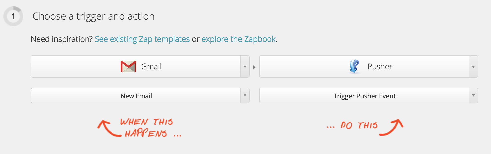
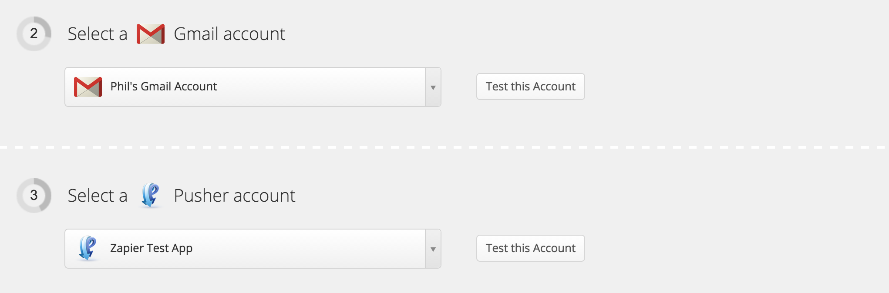
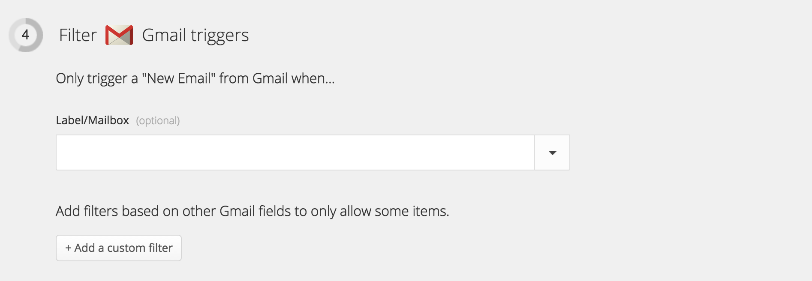
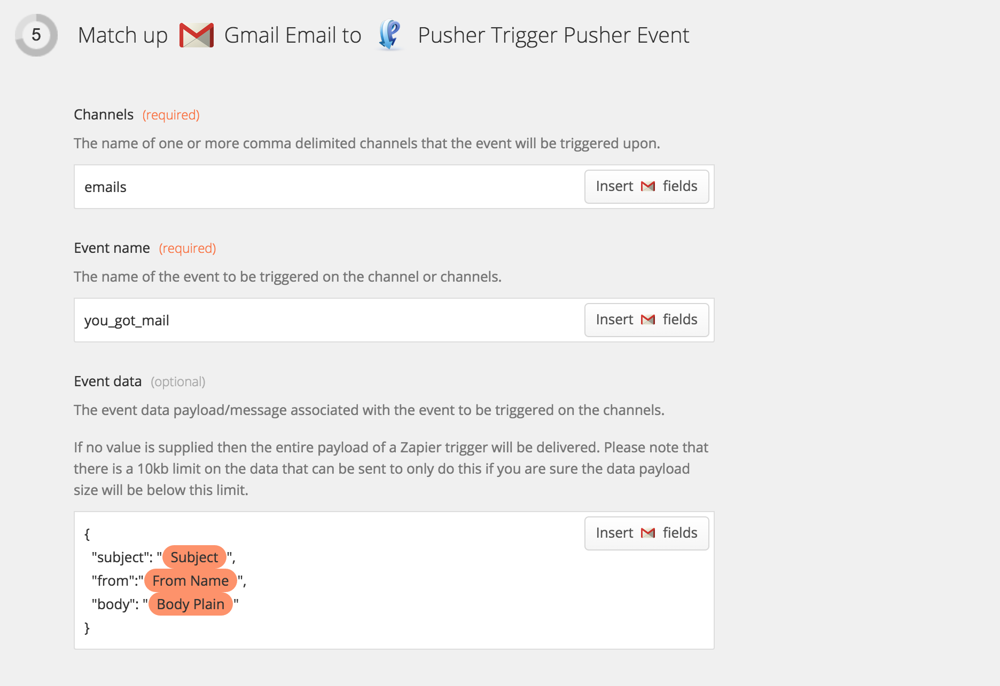

# Pusher module for Zapier

A very basic Pusher module for [Zapier](https://zapier.com).

## Creating a Zap that uses Pusher

To create a new Zap that uses Pusher is really simple.

First set up a Zapier trigger and then set Pusher as the action handler.

### Action: Trigger an event on a channel

Right now we only have one action defined. That's the *Trigger Pusher Event* as the action.



Set up the account associated with the Zapier trigger and set up the **Pusher Application** (not account) credentials that you want to trigger the Pusher event on.



Set a filter on the Zapier trigger, if required.



Define the **channels** that you want to trigger the event on. This can be one or more channels separated by commas e.g. `email` or `email,phils-email`.

Define the **name of the event** that you want to trigger on the channels e.g. `you_got_mail` or `mail_deleted`.

And define the **event data** that you want to send with the event.



### Zapier & JSON

Zapier doesn't handle JSON being defined in the text area particularly well. So, we recommend you follow these guidelines:

1. Choose variables that have a small amount of content with simple charaters. For example, Zapier doesn't like new line characters (`\n`) in the payload or it won't tread it as JSON.
2. Only choose variables that are required to ensure the size of the payload doesn't go above 10kb.
3. Consider sending data as a `String` and parsing it upon receipt in your client to avoid the Zapier JSON trickiness.

## Developer Notes

[Gulp](http://gulpjs.com/) is used as the task runner.

Dependencies for the build are presently brought in from [Bower](http://bower.io/).

```
npm install
bower install
```

CryptoJS is brought in even though Zapier does offer some crypto functionality. It was determine that the Zapier crypto functionality didn't comply with the requirements of signing Pusher requests.

### Build

This process would ideally use something like browserify or webpack. However, Zapier has it's own unique JavaScript runtime so simple file concatenation to bring in dependencies is probably fine for the moment.

```
gulp build
```

### Test

```
gulp test
```
